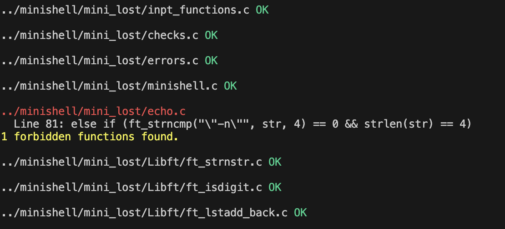

## Miller Python Script

This Python script is used to check all C files in a specified directory. It prints the path of each file and a success message if the file check is successful.

### Requirements

Python 3.6 or higher

### Usage

Clone the repository (Obviously xD!)

To run the script, navigate to the directory containing the script in your terminal and type:

```python miller.py --path /path/to/your/directory```

Replace `/path/to/your/directory` with the path of the directory you want to check.

### Arguments

- `--path`: This optional argument allows you to specify the path of the directory you want to check. If not provided, the script will check the current directory.

### Output

The script will print the path of each C file in the specified directory, followed by a success message if the file check is successful.


